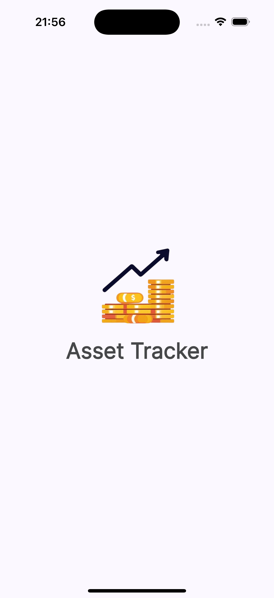
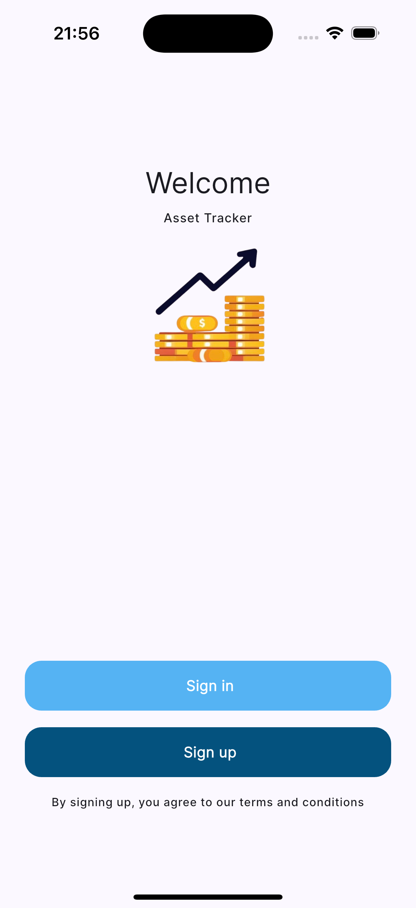
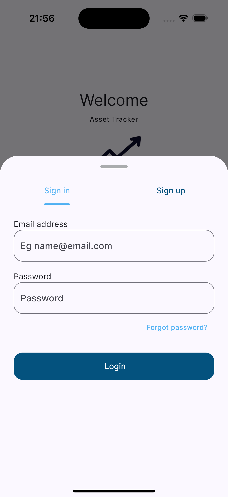
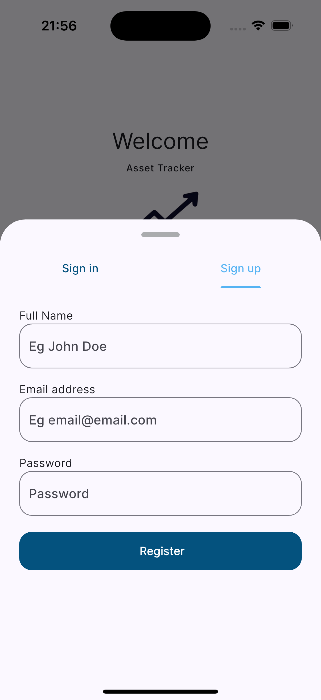

# Asset Tracker

A mobile application built with Flutter to track assets. You can view details about your assets, including their value and status. The app allows you to add new assets, track their growth, and see their current value trends.

**Currently under development.**

This project is being developed under the supervision of [Emre Gültekir](https://github.com/E-MRE).

## Screenshots

### User Screens
<table>
  <tr>
    <td>Splash Screen</td>
    <td>Registration Screen</td>
    <td>Sign In Screen</td>
    <td>Sign Up Screen</td>
  </tr>
  <tr>
    <td width="25%"></td>
    <td width="25%"></td>
    <td width="25%"></td>
    <td width="25%"></td>
  </tr>
</table>

